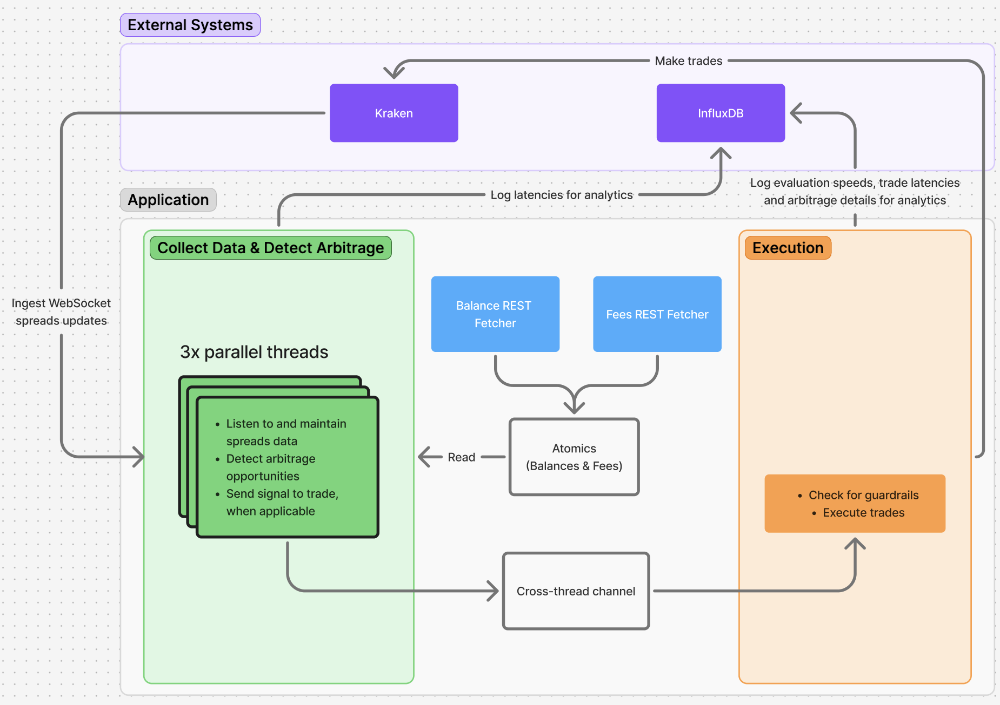

# Kraken Arbitrage Trading System - Event-Driven, Single-Cycle Approach

A high-performance, low-latency cryptocurrency arbitrage trading system built in Rust for the Kraken exchange. Monitors price spreads across USD and EUR trading pairs in real-time, identifies arbitrage opportunities, and executes trades with sub-millisecond precision using CPU core pinning, lock-free data structures, and minimal allocation paths.

Check out [this post]([url](https://open.substack.com/pub/mikealtonji/p/how-to-lose-money-really-really-fast?utm_campaign=post-expanded-share&utm_medium=web)) for a walkthrough of the entire project.

## Features

- **Real-time Price Monitoring**: Subscribes to Kraken WebSocket spread feeds for hundreds of trading pairs
- **Multi-threaded Architecture**: 6 listener threads, separate trading thread, and background fetchers
- **CPU Core Pinning**: Threads are pinned to specific CPU cores to minimize context switching and improve cache locality
- **Low-latency Trading**: Executes trades with sub-1.5ms data staleness requirements
- **Evaluation Mode**: Run without executing trades to analyze opportunities safely
- **Comprehensive Metrics**: Logs all opportunities, latencies, and performance metrics to InfluxDB
- **Telegram Notifications**: Real-time alerts for system events and errors
- **Colocation Support**: Optional support for colocated VIP endpoints for reduced latency
- **Guardrails**: Multiple safety checks including volume validation, balance limits, and trader busy flags

## Architecture



### Thread Structure

- **6 Listener Threads**: Pinned to cores 0-2 (round-robin), maintain local `PairDataVec` state, subscribe to spread data for subsets of trading pairs
- **Trading Thread**: Pinned to core 3, receives `OrderInfo` via bounded channel (size 1), manages private WebSocket for order execution
- **Balance Fetcher Thread**: Pinned to core 3, polls Kraken REST API every 2 seconds for USD/EUR balances
- **Fee Fetcher Thread**: Pinned to core 3, polls Kraken REST API every 5 minutes for trading fees

### Data Flow

1. **Price Updates**: Kraken Public WebSocket → Listener Threads → Local PairDataVec
2. **Arbitrage Evaluation**: PairDataVec → `evaluate_arbitrage()` → (if ROI > 1.0) → OrderInfo → Channel → Trading Thread
3. **Trade Execution**: Trading Thread → Private WebSocket (LIMIT IOC buy) → ownTrades listener → (filled volume) → Private WebSocket (Market sell)
4. **Balance/Fee Updates**: Kraken REST API → Fetcher Threads → Atomic Variables

### Design Decisions

- **Lock-free Data Structures**: Atomic variables for shared state (balances, fees, trader busy flag)
- **Bounded Channel**: Size 1 prevents order queue buildup; stale orders are dropped
- **Local State**: Each listener thread maintains its own `PairDataVec` to avoid contention
- **Staleness Guardrails**: Orders rejected if data is older than 1.5ms
- **Trader Busy Flag**: Prevents concurrent trade execution and order queuing
- **Batched Metrics**: InfluxDB writes batched (2500 points) to reduce overhead

## Prerequisites

- Rust toolchain (latest stable version)
- InfluxDB 1.x (for metrics storage)
- Kraken API credentials (API key and secret)
- Telegram bot token and chat ID (optional, for notifications)
- Linux or macOS (thread pinning only works on Linux)

## Environment Variables

Create a `.env` file in the project root:

```
# Kraken API credentials
KRAKEN_KEY=your_kraken_api_key
KRAKEN_SECRET=your_kraken_api_secret

# InfluxDB configuration
INFLUXDB_HOST=localhost
INFLUXDB_PORT=8086
DB_NAME=arbitrage
DB_USER=arbitrage_user
DB_PASSWORD=your_db_password

# InfluxDB admin (for setup script only)
DB_ADMIN_USER=admin
DB_ADMIN_PASSWORD=admin_password

# Retention policy
RP_NAME=default
RP_DURATION=30d

# Telegram notifications (optional)
TELEGRAM_BOT_TOKEN=your_bot_token
TELEGRAM_CHAT_ID=your_chat_id
```

## Setup Instructions

### 1. Install InfluxDB

**macOS:**
```bash
brew services start influxdb@1
```

**Linux:**
```bash
# Install InfluxDB 1.x via package manager or download from their website
sudo systemctl start influxdb
```

### 2. Initialize InfluxDB

```bash
chmod +x scripts/setup_influxdb.sh
./scripts/setup_influxdb.sh
```

This creates the database, users, retention policies, and continuous queries for aggregating metrics.

### 3. Configure Environment

Create a `.env` file with your credentials (see Environment Variables section above).

### 4. Build & Run

```bash
cargo build --release
./target/release/arbitrage --trade
```

## Command-Line Arguments

- `--trade`: Enable trading mode. Without this flag, runs in evaluation-only mode (no trades executed)
- `--colocated`: Use Beeks colocation VIP endpoints for reduced latency. Requires separate purchase.
- `--debug`: Enable debug-level logging (default is info level)

## Trading Strategy

The system implements cross-currency arbitrage:

1. **Opportunity Detection**: Evaluates arbitrage in both directions when price updates occur:
   - USD → EUR: Buy on USD pair, sell on EUR pair
   - EUR → USD: Buy on EUR pair, sell on USD pair

2. **ROI Calculation**: Accounts for spot trading fees, price spreads, and stablecoin conversion rates (USDT/USD and USDT/EUR)

3. **Volume Calculation**: Determines maximum tradeable volume based on available balance, ask volume on buy pair, and bid volume on sell pair

4. **Trade Execution**: Sends LIMIT IOC buy order at ask price, waits for fill confirmation via ownTrades WebSocket, then sends market sell order with filled volume. Blocks additional trades for 500ms to avoid race conditions.

## Monitoring and Logging

### InfluxDB Metrics

- **kraken_ingestion_latency**: Time from Kraken timestamp to system ingestion
- **arbitrage_evaluation_speed**: Time to evaluate arbitrage opportunities
- **listener_loop_speed**: Time to process each WebSocket message
- **trade_message_receive_speed**: Time from order creation to trading thread receipt
- **arbitrage_opportunity**: All detected opportunities with full details (prices, volumes, ROI)

Continuous queries aggregate these metrics into 5-minute windows with percentiles (p01, p10, p25, p50, p75, p90, p99).

### Log Files

Log files written to `logs/arbitrage_log_{timestamp}.log`. Log level is Info by default, Debug with `--debug` flag.

### Telegram Notifications

System events and errors sent to Telegram: application startup (mode: trade/evaluation), WebSocket connection failures, critical errors.

## Safety Features

- **Data Staleness Check**: Rejects orders if price data is >1.5ms old
- **Volume Validation**: Ensures minimum order size and cost requirements
- **Balance Limits**: Only trades up to available balance
- **Trader Busy Flag**: Prevents concurrent trades and drops orders when trader is processing
- **Channel Backpressure**: Bounded channel (size 1) prevents order queue buildup
- **Pair Status Check**: Only evaluates opportunities when all required pairs are online
- **Evaluation Mode**: Default mode prevents accidental trades
- **Order Limits**: LIMIT IOC orders prevent partial fills at bad prices
- **Timeout Protection**: 1-second timeout waiting for fill confirmations
- **Error Handling**: Graceful handling of WebSocket disconnections with automatic reconnection

## Disclaimer

This software is for educational and research purposes only. Cryptocurrency trading involves substantial risk of loss. Use at your own risk. The author is not responsible for any financial losses incurred from using this software.
