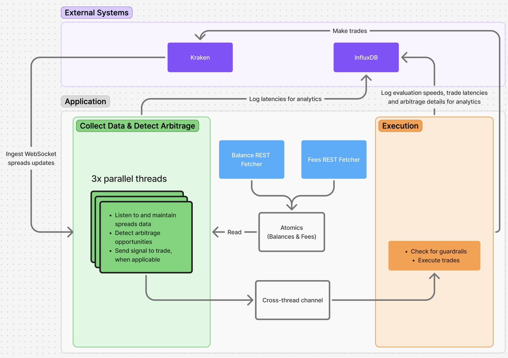

# Kraken Arbitrage Trading System - Event-Driven, Single-Cycle Approach

A high-performance, low-latency cryptocurrency arbitrage trading system built in Rust for the Kraken exchange. Monitors price spreads across USD and EUR trading pairs in real-time, identifies arbitrage opportunities, and executes trades with sub-millisecond precision using CPU core pinning, lock-free data structures, and minimal allocation paths.

Check out [this post](https://open.substack.com/pub/mikealtonji/p/how-to-lose-money-really-really-fast?utm_campaign=post-expanded-share&utm_medium=web) for a walkthrough of the entire project.

## Features

- **Real-time Price Monitoring**: Subscribes to Kraken WebSocket L2 order book feeds (depth 10) for hundreds of trading pairs, with CRC32 checksum validation
- **Multi-threaded Architecture**: 6 listener threads, separate trading thread, and background fetchers
- **CPU Core Pinning**: Threads are pinned to specific CPU cores to minimize context switching and improve cache locality
- **Low-latency Trading**: Executes trades with a data staleness guard (currently 10ms for slippage-vs-latency testing; previously 1.5ms)
- **Evaluation Mode**: Run without executing trades to analyze opportunities safely
- **Comprehensive Metrics**: Logs all opportunities, latencies, and performance metrics to InfluxDB
- **Telegram Notifications**: Real-time alerts for system events and errors
- **Colocation Support**: Optional support for colocated VIP endpoints for reduced latency
- **Guardrails**: Multiple safety checks including volume validation, balance limits, and trader busy flags

## Architecture



### Thread Structure

- **6 Listener Threads**: Pinned to cores 0-2 (round-robin), maintain local `PairDataVec` and `OrderBookVec` state, subscribe to book-10 data for subsets of trading pairs
- **Trading Thread**: Pinned to core 3, receives `OrderInfo` via bounded channel (size 1), manages private WebSocket for order execution
- **Balance Fetcher Thread**: Pinned to core 3, polls Kraken REST API every 2 seconds for USD/EUR balances
- **Fee Fetcher Thread**: Pinned to core 3, polls Kraken REST API every 5 minutes for trading fees

### Data Flow

1. **Price Updates**: Kraken Public WebSocket (book-10) → Listener Threads → Local OrderBookVec → BBO synced to PairDataVec (eval only on BBO change)
2. **Arbitrage Evaluation**: PairDataVec → `evaluate_arbitrage()` → (if ROI > 1.0) → OrderInfo → Channel → Trading Thread
3. **Trade Execution**: Trading Thread → Private WebSocket (LIMIT IOC buy) → ownTrades listener → (filled volume) → Private WebSocket (Market sell)
4. **Balance/Fee Updates**: Kraken REST API → Fetcher Threads → Atomic Variables

### Design Decisions

- **Lock-free Data Structures**: Atomic variables for shared state (balances, fees, trader busy flag)
- **Bounded Channel**: Size 1 prevents order queue buildup; stale orders are dropped
- **Local State**: Each listener thread maintains its own `PairDataVec` and `OrderBookVec` to avoid contention
- **Book Checksum Validation**: CRC32 checksum verified on every book update; mismatch disables pair and triggers reconnect
- **BBO-Only Evaluation**: Arbitrage evaluated only when best bid/ask price or volume changes, not on every depth update
- **Message-Level Staleness**: `kraken_ts` set from max timestamp of updates in the triggering message (not per-level BBO timestamps)
- **Staleness Guardrails**: Orders rejected if data is older than 10ms (temporarily raised from 1.5ms to study slippage vs latency)
- **Trader Busy Flag**: Prevents concurrent trade execution and order queuing
- **Batched Metrics**: InfluxDB writes batched (2500 points) to reduce overhead

## Prerequisites

- Rust toolchain (latest stable version)
- InfluxDB 1.x (for metrics storage)
- Kraken API credentials (API key and secret)
- Telegram bot token and chat ID (optional, for notifications)
- Linux or macOS (thread pinning only works on Linux)

## Environment Variables

Create a `.env` file in the project root:

```
# Kraken API credentials
KRAKEN_KEY=your_kraken_api_key
KRAKEN_SECRET=your_kraken_api_secret

# InfluxDB configuration
INFLUXDB_HOST=localhost
INFLUXDB_PORT=8086
DB_NAME=arbitrage
DB_USER=arbitrage_user
DB_PASSWORD=your_db_password

# InfluxDB admin (for setup script only)
DB_ADMIN_USER=admin
DB_ADMIN_PASSWORD=admin_password

# Retention policy
RP_NAME=default
RP_DURATION=30d

# Telegram notifications (optional)
TELEGRAM_BOT_TOKEN=your_bot_token
TELEGRAM_CHAT_ID=your_chat_id
```

## Setup Instructions

### 1. Install InfluxDB

**macOS:**
```bash
brew services start influxdb@1
```

**Linux:**
```bash
# Install InfluxDB 1.x via package manager or download from their website
sudo systemctl start influxdb
```

### 2. Initialize InfluxDB

```bash
chmod +x scripts/setup_influxdb.sh
./scripts/setup_influxdb.sh
```

This creates the database, users, retention policies, and continuous queries for aggregating metrics.

### 3. Configure Environment

Create a `.env` file with your credentials (see Environment Variables section above).

### 4. Build & Run

```bash
cargo build --release
./target/release/arbitrage --trade
```

## Command-Line Arguments

- `--trade`: Enable trading mode. Without this flag, runs in evaluation-only mode (no trades executed)
- `--colocated`: Use Beeks colocation VIP endpoints for reduced latency. Requires separate purchase.
- `--debug`: Enable debug-level logging (default is info level)
- `--max-walk-depth N`: Max order-book levels consumed per side in the depth walk (default 10)
- `--depth-haircut N`: Percent of displayed volume planned at levels beyond the top (default 70)
- `--roi-buffer-bps N`: Marginal ROI must exceed 1 plus this buffer to keep walking (default 2)
- `--momentum`: Enable the experimental momentum trade mode (takes priority over arbitrage)
- `--persist-updates N`: Require an improved bid/ask to survive N further BBO updates before sending an arb trade (default 0 = off). Logs `awaiting_persist` / `persist_failed` for forensics.

## Trading Strategy

The system implements cross-currency arbitrage:

1. **Opportunity Detection**: On each BBO improvement, evaluates the single direction implied by the move:
   - Ask improved (price down, or volume up at same price) → the updated pair is the buy leg
   - Bid improved (price up, or volume up at same price) → the updated pair is the sell leg
   - Both in one message → both directions evaluated

2. **ROI Calculation**: Accounts for spot trading fees, price spreads, and stablecoin conversion rates (USDT/USD and USDT/EUR)

3. **Volume Calculation (dual walk)**: A greedy two-pointer walk over the buy pair's asks and the sell pair's bids, matching volume while each marginal level pair clears fees plus the ROI buffer. Bounded by balance, `--max-walk-depth`, and the `--depth-haircut` applied to levels beyond the top. Optimal for expected PnL because marginal ROI is monotone in both books.

4. **Trade Execution**: Sends LIMIT IOC buy order priced at the deepest planned ask (sweeps all planned levels), waits for fill confirmation via ownTrades WebSocket, then sends market sell order with filled volume. Blocks additional trades for 500ms to avoid race conditions.

### Momentum mode (`--momentum`, experimental)

When the sibling pair's bid improves and its fx-converted price sits far enough above the target pair's ask that halfway convergence would cover both spot fees, the system buys the target pair with a LIMIT IOC at its current ask, holds for a log-uniformly sampled 1–1000 ms, then market sells on the same pair. Hold times are logged (`hold_ms`) so PnL can be regressed against them. Momentum takes priority over arbitrage on the events it claims. This is a directional bet with inventory risk — no ROI guarantee at entry.

## Monitoring and Logging

### InfluxDB Metrics

- **kraken_ingestion_latency**: Time from Kraken timestamp to system ingestion
- **arbitrage_evaluation_speed**: Time to evaluate arbitrage opportunities
- **listener_loop_speed**: Time to process each WebSocket message
- **trade_message_receive_speed**: Time from order creation to trading thread receipt
- **arbitrage_opportunity**: Detected opportunities (BBO + depth-walk sizing). Notable fields:
  - `limiting_volume` / `depth_volume`: size after walking the book
  - `l1_limiting_volume`: old top-of-book min(ask,bid) baseline
  - `depth_multiplier`: `depth_volume / l1_limiting_volume`
  - `roi` vs `blended_roi` / `roi_gap`: tip edge vs depth-weighted edge
  - `expected_pnl`, `trigger` tag (`bid_improved` / `ask_improved`), `balance_limited_f` (0/1 for aggregations)
- **momentum_execution** (only with `--momentum`): one point per round trip — `gap_bps`, `hold_ms`, entry/exit VWAPs, fees, `realized_pnl`, `outcome`

Continuous queries aggregate latency metrics into 5-minute windows with percentiles (p01, p10, p25, p50, p75, p90, p99).

### Chronograf dashboards

Use **Chronograf** (InfluxDB 1.x UI) — not Grafana. Copy-paste InfluxQL for existing panels and new depth-walk panels is in [`docs/chronograf-monitoring.md`](docs/chronograf-monitoring.md), including the JSONL forensics funnel.

### Forensics JSONL

Each run also writes `logs/arb_events_{timestamp}.jsonl` (planned slices, decisions, and in `--trade` mode fill outcomes). Summarize with:

```bash
python3 scripts/analyze_arb_events.py logs/arb_events_*.jsonl
python3 scripts/analyze_arb_events.py logs/arb_events_*.jsonl --since 2026-07-18T20:00:00Z
```

The analyzer supports time windows and reports win rate vs trigger, PnL residual /
slippage vs data age / ROI / depth multiplier / book consumption, and momentum win
rate vs hold time. See [`docs/chronograf-monitoring.md`](docs/chronograf-monitoring.md)
for field details and the win definition (`filled` + `partial_buy` + `sell_failed`,
`realized_pnl > 0`; residuals use completed round trips only, scaled by fill ratio).

### Log Files

Log files written to `logs/arbitrage_log_{timestamp}.log`. Log level is Info by default, Debug with `--debug` flag.

### Telegram Notifications

System events and errors sent to Telegram: application startup (mode: trade/evaluation), WebSocket connection failures, critical errors.

## Safety Features

- **Data Staleness Check**: Rejects orders if price data is >10ms old (temporary; was 1.5ms)
- **Volume Validation**: Ensures minimum order size and cost requirements
- **Balance Limits**: Only trades up to available balance
- **Trader Busy Flag**: Prevents concurrent trades and drops orders when trader is processing
- **Channel Backpressure**: Bounded channel (size 1) prevents order queue buildup
- **Pair Status Check**: Only evaluates opportunities when all required pairs are online
- **Evaluation Mode**: Default mode prevents accidental trades
- **Order Limits**: LIMIT IOC orders prevent partial fills at bad prices
- **Timeout Protection**: 1-second timeout waiting for fill confirmations
- **Error Handling**: Graceful handling of WebSocket disconnections with automatic reconnection

## Disclaimer

This software is for educational and research purposes only. Cryptocurrency trading involves substantial risk of loss. Use at your own risk. The author is not responsible for any financial losses incurred from using this software.
